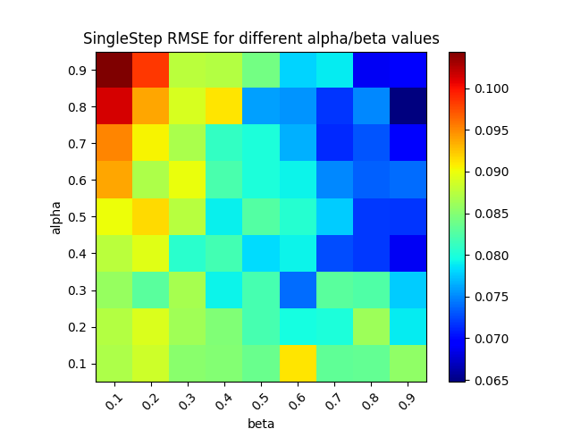
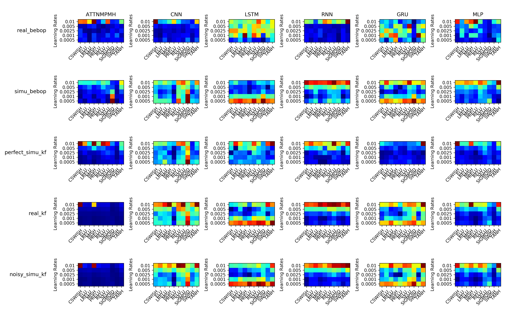
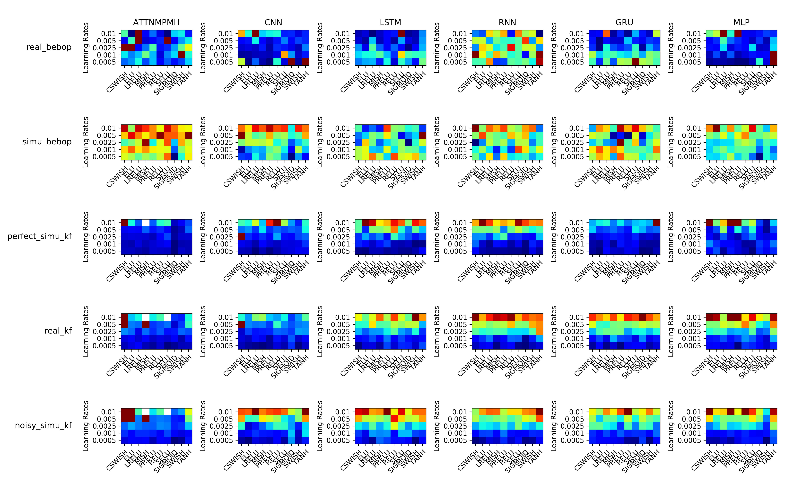
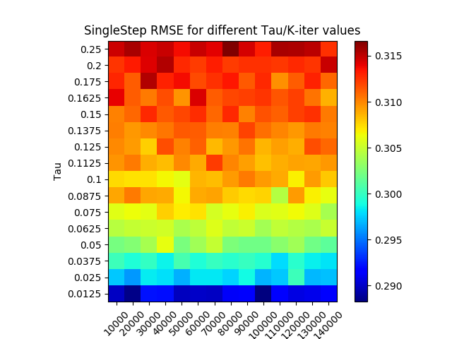
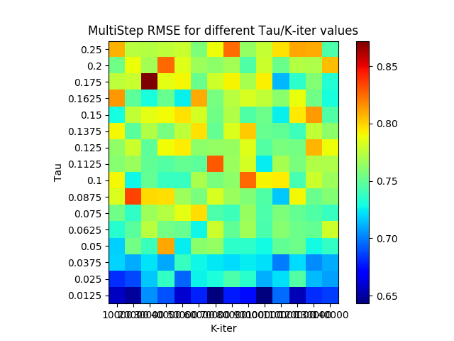

# Deep ID : a simple deep-learning based identification toolbox

Deep ID features all of the most common, and state of the art architectures for deep system identification.
It comes with a command line model generator, for MLPs, 1D CNNs, RNNs, LSTMs, GRUs and Attention based models.
Additionnaly this toolbox provide support for advanced data handling such as: continuous-time seq2seq, prioritized
 experience replay, and gradient upper-bound priorization schemes. It also features partial support for the Co-Teaching
 training but our test results were inconclusive.
Finally, Deep ID implements the most common tools for proper model evaluation such has k-fold Cross Validation,
singlestep and multistep error evaluation along with a TensorBoard backend for visualization. 
With over 35 parameters available from command line Deep ID is extremely flexible making grid searches easy and efficient.
More about Deep ID below.

> Next revision will explore Bayesian NN, and uncertainty modeling. 

## Using DeepID

This section covers how to use the DeepID toolbox.

### Prerequisite

To run DeepID you need:
- TensorFlow v1.14.0 or 1.15.0 (and the associated CUDA/CUDNN requirements)
- Scikit-Learn
- Numpy
- Python3 **(REQUIRED FOR TRAINING ONLY)**
- Compatibility with ROS.

This Framework was sucessfully tested on the
following system architectures PPC64, AARCH64 and x64. 

Please note that for the simplest model it might be worth to train on a CPU instead of a GPU.

### Running DeepID
To run DeepID issue the following command:

 - ``python3 run_training.py ''A list of arguments''``
 - ``python3 run_training.py --help`` gives you the exhaustive list of arguments.

To learn more about the available arguments please refere to the ReadMe located under networks.
A small example of how to train your own models is available in the ReadMe located under example.

## What can I do with DeepID ?

DeepID can be use to solve various optimum parameters problems search thanks to its generous argument parser.

### Ever wondered what PER weights you should use for best results?
Wonder no more, modify one of our PER script and you are set. Here, we want to know which alpha/beta parameters we should use to train a NN for an MPPI controler. (Lower/Bluer is better)

  
   

### Maybe you want to know which activation function works best?
#### Single-step accuracy 

#### Multi-step accuracy

In this case the CNNs seems to like the PRELU, but for the rest of the networks it is hard to say... surprisingly the sigmoid looks like a viable option, swish seems to have good results as well. If anything this shows that there is no reason to favor ReLUs over anything else.

### Or if Co-Teaching is suitable for regression?

  
   

Clearly our implementation of Co-Teaching does not work as intended. This is to be expected as it was
 originally designed for classification problems and not regression. It could also be that our dataset is not noisy enough.

